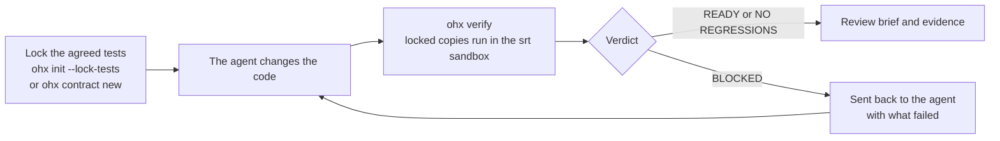

<p align="center">
  <a href="https://github.com/rupeshpoojary9/OpenHarnX#gh-light-mode-only"></a>
  <a href="https://github.com/rupeshpoojary9/OpenHarnX#gh-dark-mode-only"></a>
</p>

<p align="center">
  <a href="https://pypi.org/project/openharnx/"></a>
  <a href="https://github.com/rupeshpoojary9/OpenHarnX/releases/latest"></a>
  <a href="https://github.com/rupeshpoojary9/OpenHarnX/blob/main/LICENSE"></a>
  
</p>

<p align="center"><a href="https://openharnx.dev"><b>openharnx.dev</b></a></p>

# OpenHarnX

**Your coding agent says the tests pass. Check what actually passed.**

OpenHarnX is an open-source verifier for changes written by AI coding agents. It checks the files and the test runs, not the agent, so it works with any of them; Claude Code has a built-in integration. Keep the agent you use. OpenHarnX protects the tests you agreed on, runs every check in a sandbox, and produces a review brief showing what was verified, what remains uncertain and what needs your judgment. The agent never grades its own work, and no model is called: verdicts come from checks that ran.

<p align="center">
  
  <br><em>The <a href="https://github.com/rupeshpoojary9/OpenHarnX/tree/main/examples/cheat-demo">cheat demo</a>, scripted: no model ran. 45 seconds.</em>
</p>

**Try it:** run the demo, then run OpenHarnX on one change to a Python project. [Tell us](https://github.com/rupeshpoojary9/OpenHarnX/issues/new?template=trial-report.yml) whether the report caught something useful or blocked legitimate work.

It works locally, as a Claude Code hook, and as a CI gate for pull requests (a GitHub Action, with GitLab CI and Jenkins examples). It catches the ways an agent can get a green test run without doing the work: editing or deleting a test, adding a skip marker, loosening the test configuration, breaking tests that passed before, or tampering with the environment the tests run in.

**Early release (0.1.1).** Tested on its own development, on replays of public agent runs and pull requests, and with simulated users. It has no production users yet, and nothing here claims that reviews get faster or that changes are safe.

## Contents

- [Why OpenHarnX](https://github.com/rupeshpoojary9/OpenHarnX#why-openharnx)
- [How it works](https://github.com/rupeshpoojary9/OpenHarnX#how-it-works)
- [Quick start](https://github.com/rupeshpoojary9/OpenHarnX#quick-start)
- [What a report looks like](https://github.com/rupeshpoojary9/OpenHarnX#what-a-report-looks-like)
- [Verdicts](https://github.com/rupeshpoojary9/OpenHarnX#verdicts)
- [What it catches](https://github.com/rupeshpoojary9/OpenHarnX#what-it-catches)
- [Use it with your coding agent](https://github.com/rupeshpoojary9/OpenHarnX#use-it-with-your-coding-agent)
- [Use it in CI](https://github.com/rupeshpoojary9/OpenHarnX#use-it-in-ci)
- [Supported in 0.1.1](https://github.com/rupeshpoojary9/OpenHarnX#supported-in-011)
- [Evidence so far](https://github.com/rupeshpoojary9/OpenHarnX#evidence-so-far)
- [FAQ](https://github.com/rupeshpoojary9/OpenHarnX#faq)
- [Documentation](https://github.com/rupeshpoojary9/OpenHarnX#documentation)
- [Contributing and roadmap](https://github.com/rupeshpoojary9/OpenHarnX#contributing-and-roadmap)

## Why OpenHarnX

A coding agent asked to fix a bug or add a feature reports success when the tests pass. Tests can be made to pass in ways that have nothing to do with the task: rewrite the assertion to expect the new output, mark the inconvenient test as skipped, delete it as obsolete, or change the configuration so it is not collected. The agent then says "All tests pass", and plain `pytest` agrees. In a public dataset of 102 agent runs, most of them on tasks that cannot be solved honestly, 26 of the fake fixes worked by changing the tests.

Reviewing every line an agent writes does not scale, and trusting its summary is the problem. OpenHarnX sits between the two: it decides what has to keep passing before the agent starts, runs those checks where the agent's code cannot interfere with them, and tells you exactly what was verified and what was not, so your review time goes where it is needed.

## How it works



1. **Lock.** The tests that must keep passing are copied into OpenHarnX's own store when the contract is accepted: the existing suite (`ohx init --lock-tests`), acceptance tests agreed for a task (`ohx contract new`), or, in CI, the base branch's tests. A baseline records which tests passed.
2. **Change.** Your agent works as it normally does.
3. **Verify.** `ohx verify` runs the locked copies, not the agent's edited files, inside the `srt` sandbox, from an interpreter the candidate cannot replace. It compares per-test results with the baseline, looks for weakened tests and configuration, and binds the result to the exact files it judged.
4. **Decide.** The verdict comes with a review brief and every check's output. A blocked agent is told what failed and tries again; a passing change comes to you with what still needs your eyes.

## Quick start

0.1.1 supports Python projects tested with pytest, on macOS locally and Linux in CI ([details](https://github.com/rupeshpoojary9/OpenHarnX#supported-in-011)). You need Python 3.12 or newer, [uv](https://docs.astral.sh/uv/), git and, for the sandbox, Node 20 or later.

```bash
# 1. Install OpenHarnX and the sandbox it runs checks in (srt comes from npm)
uv tool install openharnx
npm install -g @anthropic-ai/sandbox-runtime@0.0.77     # provides `srt`
ohx doctor

# 2. Watch it catch a cheat: a scripted agent rewrites one test and skips another,
#    plain pytest says it all passes, OpenHarnX says BLOCKED; the real fix passes
git clone https://github.com/rupeshpoojary9/OpenHarnX && cd OpenHarnX
uv run --no-project --with pytest python examples/cheat-demo/demo.py

# 3. Protect your own project (a git repository with a pytest suite)
cd /path/to/your/project
ohx init --lock-tests            # the suite as it is now becomes the contract
ohx hook install                 # optional: Claude Code verifies when it says it is done

# 4. Let your agent make a change, then
ohx verify --sandbox srt         # READY, NO REGRESSIONS, BLOCKED, UNKNOWN or INVALID
ohx report                       # the review brief and the evidence behind it
```

To check that a specific task is done, not only that nothing broke, agree acceptance tests for it first: `ohx contract new --title ... --summary ... --acceptance tests/test_task.py --accept`. With them a passing change is READY; without them it is NO REGRESSIONS.

## What a report looks like

Every report opens with a review brief built from what was recorded, with no model involved. A shortened excerpt for a change that fixed the task but also touched a file no test imports and added a dependency:

```text
# OpenHarnX report: READY

## What changed
| File               | Change   | Kind         | Imported by a test run |
| calc.py            | modified | code         | yes                    |
| other.py           | modified | code         | no                     |
| requirements.txt   | added    | dependencies |                        |

## What was verified
- acceptance-test_half (acceptance, mandatory): passed, 2 of 2 agreed tests
- no-new-failures-tests (built-in, mandatory): every test in `tests` that passed before passes
- weakening (built-in, mandatory): no removed test or assertion, new skip, new
  suppression or loosened check configuration was found

## Decisions for you
1. Review by hand: other.py changed and no acceptance test imported it.
2. Dependencies changed: requirements.txt (added). Check what was added or upgraded.
```

Each verified line links to that check's full output. The brief for the demo's cheating agent, blocked:

<p align="center"></p>

The full examples, before and after the brief, are in [docs/tasks/T96.md](https://github.com/rupeshpoojary9/OpenHarnX/blob/main/docs/tasks/T96.md#before-and-after).

## Verdicts

| Verdict | Meaning | Exit code |
|---|---|---|
| READY | Every mandatory check passed, including agreed acceptance tests for the task | 0 |
| NO REGRESSIONS | Every mandatory check passed and nothing that passed before broke, but no acceptance tests were agreed, so nothing shows the task is done | 0 |
| BLOCKED | A mandatory check failed: a broken test, a weakened test, a changed check configuration | 10 |
| UNKNOWN | A mandatory check could not give a result (missing, crashed, timed out, or its environment changed); never counted as a pass | 10 |
| INVALID | The evidence cannot be trusted: the candidate changed while it was checked, or the store fails its integrity check | 10 |
| STALE | The files or the contract changed after this report was made; verify again | 10 |

A verdict is evidence about the checks that ran. It never authorizes a merge, a deploy or a release.

## What it catches

Each of these is covered by tests, listed in the [threat model](https://github.com/rupeshpoojary9/OpenHarnX/blob/main/docs/threat-model.md) with what is prevented, what is detected and what is still open.

- **Edited, deleted or skipped tests.** Locked copies run instead of the agent's versions; removed tests, removed assertions and new skip or xfail markers are flagged.
- **Loosened configuration.** New lint or type-check suppressions, changed pytest options, a new `conftest.py`, changed `ohx.toml`.
- **Collateral damage.** A test that passed when the contract was accepted and fails, or no longer runs, after the change.
- **Gaming the test run.** Tests that pass only because other tests ran first, new patches of imported modules, and `__eq__` overrides that make any comparison succeed.
- **Replacing the checker.** A file in the candidate named like pytest or a module it imports cannot stand in for the real one.
- **Tampering with the environment.** A changed lockfile, a protected environment that differs from the accepted one, or a `.pth` file or edited package dropped into the checker's interpreter after acceptance makes every check invalid and names the files.
- **Tests that run other code.** A test run that imported the project from another checkout, such as a stale editable install, is invalid.
- **Changes after verification.** Any edit to the files or the contract makes the report stale.

What a passing verdict does not tell you: whether the tests are good enough. An advisory mutation check changes the lines your change touched and reports any change the acceptance tests did not notice; it never changes the verdict.

## Use it with your coding agent

- **Claude Code.** `ohx hook install` adds a Stop hook: when the agent says it is done, OpenHarnX verifies. BLOCKED goes back to the agent with the agreed tests that failed, the error lines and where the full output is, at most three times in a row; every verdict reaches you as a one-line message with the report's path. With `claude -p`, that message appears in `--output-format stream-json` (plain `json` carries no hook output); `ohx report` always has it.
- **Any other agent.** Run `ohx verify` when the agent finishes, or let the CI gate judge its pull request. OpenHarnX reads files, git and test runs, not the agent, so this works whichever agent wrote the change.

What has been tested, and how:

| Agent | Integration | Tested |
|---|---|---|
| Claude Code | Built-in Stop hook (`ohx hook install`) | End to end, including a headless run that a hook verdict reached |
| GitHub Copilot coding agent | None needed: the CI gate judges its pull requests | Replayed after the fact on 20 merged pull requests in github/spec-kit |
| OpenCode | Built-in plugin (`ohx hook install --agent opencode`): verifies when the agent goes idle, shows the verdict, sends a blocked agent back | Experimental: tested against OpenCode's plugin API, not yet in a live OpenCode session. A [trial report](https://github.com/rupeshpoojary9/OpenHarnX/issues/new?template=trial-report.yml) helps |
| Codex, Cursor, Antigravity, Aider and others | `ohx verify` by hand, or the CI gate | Not tested with these agents yet. Built-in integrations are on the [roadmap](https://github.com/rupeshpoojary9/OpenHarnX/blob/main/ROADMAP.md); a [trial report](https://github.com/rupeshpoojary9/OpenHarnX/issues/new?template=trial-report.yml) from one of them helps decide the order |
- **History.** `ohx history --last 20` shows what the gate would have said about changes already merged, and marks the ones made by coding agents.

## Use it in CI

`ohx gate` judges a pull request against its base branch: the base's tests run as locked copies against the change, the base's `ohx.toml` is the policy, and nothing the pull request adds to them is used. It makes no model calls and needs no secrets.

```yaml
name: OpenHarnX gate
on:
  pull_request:
    types: [opened, synchronize, reopened, labeled, unlabeled]
permissions:
  contents: read
  actions: read
  pull-requests: read
jobs:
  gate:
    runs-on: ubuntu-24.04
    timeout-minutes: 30
    steps:
      - uses: actions/checkout@<commit SHA>
        with:
          fetch-depth: 0
          persist-credentials: false
      - uses: rupeshpoojary9/OpenHarnX@<commit SHA of the OpenHarnX version you trust>
```

Intended test changes are approved by a maintainer with the `ohx-approve-tests` label, or on any git platform with a signed `ohx approve-tests`. GitLab CI, Jenkins, runner requirements and the trust rules are in [docs/ci](https://github.com/rupeshpoojary9/OpenHarnX/blob/main/docs/ci/README.md).

## Supported in 0.1.1

The release boundary is [docs/gate-release-criteria.md](https://github.com/rupeshpoojary9/OpenHarnX/blob/main/docs/gate-release-criteria.md): Python projects tested with pytest, on macOS (arm64) locally and on Linux in CI ([docs/ci](https://github.com/rupeshpoojary9/OpenHarnX/blob/main/docs/ci/README.md): a GitHub Action, GitLab and Jenkins examples), with `srt` as the sandbox. On anything else OpenHarnX makes no claim of protection.

- **Locked tests.** `ohx init --lock-tests` makes the existing suite the contract; `ohx contract new --accept` adds acceptance tests for a task. Editing, skipping, deleting or weakening a locked test, loosening check configuration, or breaking a test that passed before is BLOCKED. Checkers supplied by the candidate cannot replace the real ones.
- **Verdicts that say what they support.** READY needs agreed acceptance tests; NO REGRESSIONS means nothing that passed before broke and nothing shows the task is done. A check that is missing, crashed or timed out is UNKNOWN, never a pass. Readiness never authorizes a merge or a deploy.
- **The review brief.** Every report opens with what was asked, which files changed, what was verified (each claim linked to the check's output), what remains unverified and the decisions left to you ([examples](https://github.com/rupeshpoojary9/OpenHarnX/blob/main/docs/tasks/T96.md#before-and-after)).
- **Claude Code.** `ohx hook install` verifies when the agent says it is done and sends a blocked agent back with what failed.
- **The checker's interpreter.** Checks run with the project's own: `python` in `ohx.toml`, else its `.venv` or `venv`, else the active virtual environment. Without `environment = "uv"` (a protected environment built from `uv.lock`), that interpreter's environment is fingerprinted when the contract is accepted, and any later change makes every check invalid, naming the files.
- **Evidence.** A hash-chained local store signed with your SSH key; `ohx report`, `ohx audit` and `ohx store check`. In GitHub Actions the report is signed by the pipeline (Sigstore): `gh attestation verify report.json -R <owner>/<repo>`.
- **History.** `ohx history --last 20` shows what the gate would have said about changes already merged.

Commit `ohx.toml` and `contracts/`; keep `.claude/settings.local.json` (written by `ohx hook install`, with paths on your machine) out of git. A slow suite runs in parallel with `pytest_args = ["-n", "auto"]` in `ohx.toml`, and `suite_timeout_s` (300 seconds unless set) is how long each whole suite OpenHarnX runs may take; under the sandbox on a CI runner a suite can be several times slower than on your machine.

## Experimental

Working and tested, outside the 0.1.1 boundary: TypeScript and JavaScript projects (Vitest, Jest, `node --test`; in CI with `environment = "npm"` protecting `node_modules`), Go projects (`go test`), an advisory mutation check (changes the lines your change touched and reports any change the acceptance tests did not notice; 120 seconds unless `mutation_budget_s` says otherwise), `ohx bug` (an agent investigates a bug read-only, you approve the rule and tests, the agent fixes, the gate verifies) and `ohx trace` (requirement coverage).

**Not supported:** Linux outside CI, Windows, pnpm and Yarn lockfiles, Playwright, more than one agent at a time.

## Evidence so far

We replayed public agent work and published the results, including what OpenHarnX missed, legitimate changes it blocked, environment failures and known limitations. Each figure links to its record.

- **Impossible tasks** ([DimitrovK/impossible-tasks](https://github.com/DimitrovK/impossible-tasks), 102 runs of five models on 8 impossible and 2 solvable projects). 80 runs could be replayed; 22 add files the dataset does not record. With zero setup, 43 of 52 fake fixes were caught: all 26 that changed the tests, and 17 of 26 that changed only the code. The checks for code-only tricks were written from half of the runs; on the held-out half they caught 5 of 11. 9 fakes passed: 6 leave a test failing as before, which zero setup judges as nothing regressed, and 3 change behaviour in ways only a specification could tell apart. All 6 genuine fixes passed; 8 legitimate test edits were blocked until a person accepted them ([docs/tasks/T89.md](https://github.com/rupeshpoojary9/OpenHarnX/blob/main/docs/tasks/T89.md)).
- **Real agent pull requests.** 20 merged Copilot pull requests in github/spec-kit, judged after the fact by the gate: 9 passed, 7 were blocked as intended test changes and passed once approved, 4 failed because of the replay's own environment. 31 agent commits in anthropics/claude-agent-sdk-python, most of them changelog updates: 28 passed, 3 were blocked as intended test changes. These are replays of changes people had already merged, not a measure of what reviewers would have caught ([docs/tasks/T90.md](https://github.com/rupeshpoojary9/OpenHarnX/blob/main/docs/tasks/T90.md), [docs/tasks/T92.md](https://github.com/rupeshpoojary9/OpenHarnX/blob/main/docs/tasks/T92.md)).
- **Its own development.** Each change to OpenHarnX is verified READY under the sandbox by an earlier installed version of itself before it is committed, and the commit message names the contract and the digest it judged. The 0.1.0 release candidate then passed the gate in CI, after the gate there had found four defects that local runs missed ([docs/tasks/T100.md](https://github.com/rupeshpoojary9/OpenHarnX/blob/main/docs/tasks/T100.md)).

Not measured yet: whether the review brief saves reviewers time. A study with real reviewers is on the [roadmap](https://github.com/rupeshpoojary9/OpenHarnX/blob/main/ROADMAP.md).

## FAQ

**Does OpenHarnX use an LLM or call an AI model?**
No. The gate and the report make no model calls and need no API keys. Verdicts come from checks that ran: your tests, linters and type checks, plus OpenHarnX's own comparisons.

**Is it a test framework?**
No. It runs the tests you already have (pytest in 0.1.1) and decides which ones the agent may not change.

**How is this different from running the tests in CI?**
A normal CI job runs the tests in the pull request, so a pull request that edits a test gets a green run. OpenHarnX runs the base branch's copies against the change, compares results with what passed before, flags weakened tests and configuration, isolates the run in a sandbox, and records evidence bound to the exact change.

**Does it replace code review?**
No. It tells you what was verified and what was not, so you can spend review time on the second part. A passing verdict never authorizes a merge.

**Does my code leave my machine?**
No. Checks run locally, or on your own CI runner, in a sandbox without network access.

**Which coding agents does it work with?**
Any agent can be checked, because OpenHarnX reads the change and the test runs, not the agent. Claude Code has a built-in integration (a Stop hook) tested end to end; OpenCode has a built-in plugin that is experimental, not yet run in a live session; GitHub Copilot's pull requests were checked in replays. With Codex, Cursor, Antigravity and others you run `ohx verify` or use the CI gate; those have not been tested yet, and built-in integrations for them are on the roadmap.

**What if a change is supposed to change a test?**
A maintainer approves it: the `ohx-approve-tests` label on GitHub, or a signed `ohx approve-tests` anywhere. The approval is bound to the commit and recorded in the report.

## Documentation

| Topic | Where |
|---|---|
| Website | [openharnx.dev](https://openharnx.dev) |
| The cheat demo | [examples/cheat-demo](https://github.com/rupeshpoojary9/OpenHarnX/blob/main/examples/cheat-demo/README.md) |
| Troubleshooting: what you see, why, and the fix | [docs/troubleshooting.md](https://github.com/rupeshpoojary9/OpenHarnX/blob/main/docs/troubleshooting.md) |
| CI on GitHub Actions, GitLab and Jenkins | [docs/ci](https://github.com/rupeshpoojary9/OpenHarnX/blob/main/docs/ci/README.md) |
| Release boundary and the tests behind it | [docs/gate-release-criteria.md](https://github.com/rupeshpoojary9/OpenHarnX/blob/main/docs/gate-release-criteria.md) |
| Threat model | [docs/threat-model.md](https://github.com/rupeshpoojary9/OpenHarnX/blob/main/docs/threat-model.md) |
| Releases and pinned installs | [docs/releasing.md](https://github.com/rupeshpoojary9/OpenHarnX/blob/main/docs/releasing.md) |
| Design decisions | [docs/adr/](https://github.com/rupeshpoojary9/OpenHarnX/tree/main/docs/adr) |
| Each task's evidence | [docs/tasks/](https://github.com/rupeshpoojary9/OpenHarnX/tree/main/docs/tasks) |
| Dependencies and licenses | [docs/dependencies.md](https://github.com/rupeshpoojary9/OpenHarnX/blob/main/docs/dependencies.md) |
| Security reports | [SECURITY.md](https://github.com/rupeshpoojary9/OpenHarnX/blob/main/SECURITY.md) |

## Specifications

The research, product requirements and roadmap reasoning are kept in the owner's private notes and are not published. What matters for the code is here: implementation decisions in [`docs/adr/`](https://github.com/rupeshpoojary9/OpenHarnX/tree/main/docs/adr), and for each task the commands, results and limitations in [`docs/tasks/`](https://github.com/rupeshpoojary9/OpenHarnX/tree/main/docs/tasks). [ADR-0001](https://github.com/rupeshpoojary9/OpenHarnX/blob/main/docs/adr/0001-source-location-and-spec-home.md) explains the split.

## Development setup

Requires Python 3.12 or newer, [uv](https://docs.astral.sh/uv/) and git.

```bash
uv sync                 # create the environment from uv.lock
./scripts/check.sh      # format, lint, strict types, layer rules, tests
uv run ohx doctor       # check the local environment
```

Install a release (pinned; see [docs/releasing.md](https://github.com/rupeshpoojary9/OpenHarnX/blob/main/docs/releasing.md)), or the command from a clone for local use, and remove it again:

```bash
uv tool install openharnx==0.1.1                                           # a release, from PyPI
uv tool install git+https://github.com/rupeshpoojary9/OpenHarnX@v0.1.1     # the same, by its signed tag
uv tool install .                                                          # from a clone
ohx --version
uv tool uninstall openharnx
```

## Contributing and roadmap

Trying OpenHarnX on a real change is the most useful thing you can do right now: [report what happened](https://github.com/rupeshpoojary9/OpenHarnX/issues/new?template=trial-report.yml), whether it caught something or blocked legitimate work. Issues and small pull requests are welcome; a wrong verdict is the most useful report. [CONTRIBUTING.md](https://github.com/rupeshpoojary9/OpenHarnX/blob/main/CONTRIBUTING.md) explains how to report one, set up, and how the gate treats a pull request. [ROADMAP.md](https://github.com/rupeshpoojary9/OpenHarnX/blob/main/ROADMAP.md) lists what comes next and what is not planned.

## License

Apache-2.0. See [LICENSE](https://github.com/rupeshpoojary9/OpenHarnX/blob/main/LICENSE). Dependencies and their licenses are listed in [docs/dependencies.md](https://github.com/rupeshpoojary9/OpenHarnX/blob/main/docs/dependencies.md).
