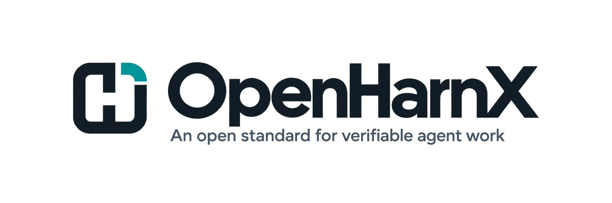

<p align="center">
  <picture>
    <source media="(prefers-color-scheme: dark)" srcset="docs/assets/openharnx-logo-dark.png">
    
  </picture>
</p>

# OpenHarnX

OpenHarnX is a local-first delivery system that plans, staffs, controls and verifies work done by existing coding agents such as Claude Code and Codex, and learns which team configurations actually work.

## Status

**Early, private, not yet released.** What works today, on macOS with Python projects tested with pytest and TypeScript or JavaScript projects tested with Vitest, Jest or `node --test` (in CI too, with `environment = "npm"` protecting `node_modules`), and Go projects tested with `go test` (validated on Linux):

- **Zero setup.** `ohx init --lock-tests` makes the existing test suite the contract; `ohx verify` then blocks a change that breaks, skips or edits its way past it. `ohx hook install` makes Claude Code verify when the agent says it is done and sends BLOCKED back to the agent.
- **The gate.** `ohx contract new --accept` locks a contract and protected copies of its acceptance tests; `ohx verify --sandbox srt` runs every check in the `srt` sandbox and gives READY, BLOCKED, UNKNOWN or INVALID. It blocks weakened checks, broken tests that passed before, and checkers supplied by the candidate. No model calls.
- **Evidence.** A hash-chained local store, signed with the owner's SSH key; `ohx report`, `ohx audit` (who did what and touched what) and `ohx store check`.
- **`ohx bug`.** An agent (Claude Code) investigates read-only, the owner approves the rule and the tests, the agent fixes, the gate verifies.

The public gate has its own release boundary: [docs/gate-release-criteria.md](docs/gate-release-criteria.md). It is not yet met (the cheat demo, branch protection for the workflow, CI signing, a public install).

**Not supported yet:** Linux outside CI, Windows, other languages, TypeScript, JavaScript and Go in `ohx bug`, pnpm and Yarn lockfiles, Playwright, more than one agent at a time. On anything outside the supported list OpenHarnX makes no claim of protection.

## Specifications

The research, product requirements, architecture and roadmap live outside this repository, in the project owner's notes vault:

- Research index: `02 Projects/OpenHarnX Research/00 Read This First.md`
- Product requirements: `02 Projects/OpenHarnX Research/PRD/`
- Architecture: `02 Projects/OpenHarnX Research/Design/Architecture.md`
- Roadmap and task checklist: `02 Projects/OpenHarnX Research/PRD/ROADMAP.md` and `CHECKLIST.md`

Implementation decisions for this code base are recorded in [`docs/adr/`](docs/adr/). See [ADR-0001](docs/adr/0001-source-location-and-spec-home.md) for why the specifications and code live apart.

## Development setup

Requires Python 3.12 or newer, [uv](https://docs.astral.sh/uv/) and git.

```bash
uv sync                 # create the environment from uv.lock
./scripts/check.sh      # format, lint, strict types, layer rules, tests
uv run ohx doctor       # check the local environment
```

Install the command for local use, and remove it again:

```bash
uv tool install .
ohx --version
uv tool uninstall openharnx
```

## Exit codes

| Code | Meaning |
|---|---|
| 0 | Success or ready |
| 10 | Valid result that is blocked, unknown or failing a required check |
| 2 | Usage or input error |
| 1 | Internal failure |

## License

Apache-2.0. See [LICENSE](LICENSE). Dependencies and their licenses are listed in [docs/dependencies.md](docs/dependencies.md).
